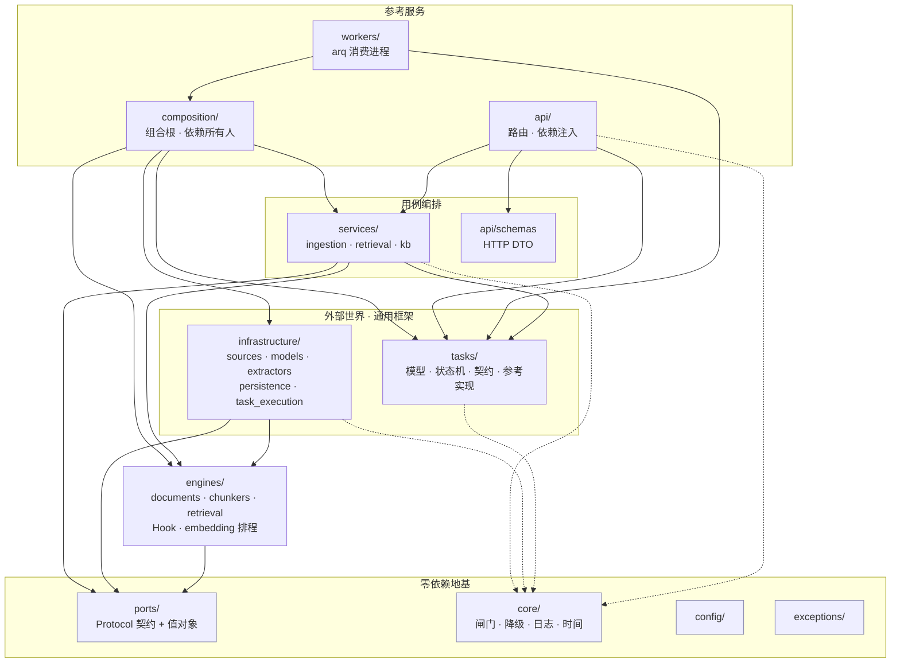
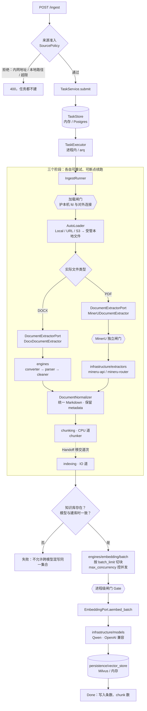
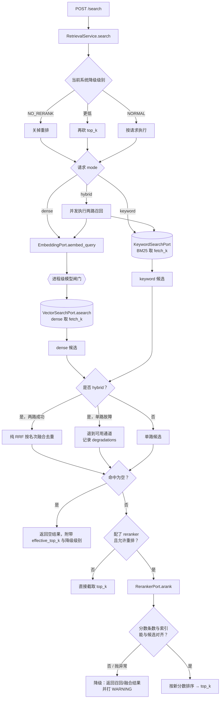

# 目录结构与核心流程

本文回答两个问题：**东西放在哪**，以及**一次请求怎么走完全程**。

图里画的是**实际的依赖边**（用 AST 扫出来的），不是理想中的分层。两者不一致
的地方在文末「已知的接缝」里列出来了 —— 一份画着理想图的架构文档，正是本项目
踩过的那种坑：文档说的规则和守卫执行的规则不是同一条，中间的缝刚好够放一个错误。

## 目录

```text
comet_rag/
├── pipeline.py         库用户便捷入口；只在这里装配默认 Loader
├── loaders/            Loader 稳定公共门面（S3 惰性导出）
├── api/                FastAPI 入口
│   ├── routes/         ingest · search · kb · tasks · admin
│   └── schemas/        仅 HTTP 请求/响应 DTO
├── workers/            arq 消费进程；按 CPU / IO 负载分道
├── composition/        服务组合根与长生命周期 Context
├── services/           用例、策略编排与 Pipeline
├── tasks/              通用任务内核、契约与无外部依赖参考实现
├── infrastructure/     所有外部适配器
│   ├── sources/        Local · HTTP · S3 · AutoLoader
│   ├── extractors/     MinerU HTTP 文档提取
│   ├── models/         embedding · reranker · vision
│   ├── persistence/
│   │   ├── sql/        SQLAlchemy 会话与 ORM
│   │   ├── vector_store/ Milvus · 内存
│   │   ├── task_store/ PostgreSQL TaskStore
│   │   └── knowledge_base/ PostgreSQL · 内存 Repository
│   └── task_execution/ ARQ / Redis 执行适配器
├── engines/            纯计算算法
│   ├── documents/
│   │   ├── formats.py  文件格式与解析配置
│   │   ├── normalization/ 跨格式 Markdown 规范化
│   │   └── docx/       converter · parser · cleaner · extractor · OMML
│   ├── chunkers/       文本 · 结构化 · 代码
│   ├── embedding/      批量排程，不发模型请求
│   ├── retrieval/      RRF 等纯计算算法
│   ├── pipelines/      Hook 与 Pipeline 值对象，不做外部装配
│   └── converters/     多格式可复用的基础转换与压缩包防护
├── ports/              契约和值对象（只依赖标准库）
├── core/               闸门、降级、日志、追踪、时间
├── config/             YAML + 环境变量
└── exceptions/
```

重构前的 `engines/loaders`、泛化 `infrastructure/providers`、宽泛 `database`、
`vectorstore` 以及顶层 HTTP `schemas` 已删除。内部能力只有一个规范位置；库用户从
`comet_rag.loaders` 与 `comet_rag.pipeline` 两个稳定门面进入。

## 模块依赖



**依赖只能向下。** `tests/unit/test_layering.py` 用 AST 强制三条：

| # | 规则 | 破了会怎样 |
|---|------|-----------|
| 1 | `engines/` 不得 import redis / pymilvus / sqlalchemy / arq / fastapi … | 装一个 docx 解析器要拖进一整套中间件，「库」那一半作废 |
| 2 | `engines/` 只能 import `engines` 和 `ports`（**白名单**） | 底层反向依赖上层，`ports/` 存在的意义消失 |
| 3 | `services/` 与 `engines/` 不得 import `infrastructure.models` | 供应商细节泄漏到用例，换模型要改业务代码 |
| 4 | `core/` 不得 import 本项目任何其他包 | 人人依赖的内核回头依赖上层，立刻出环 |
| 5 | 顶层包之间不得成环 | 环里的包无法被单独理解或单独拿走 |

第 2 条原本是黑名单（禁 api / workers / services）。黑名单只拦得住已经想到的
那几个 —— 后来新增的 `application/` 就从缝里溜了进去。白名单没有这个失效模式：
新包默认被拒。

## 入库流程



窗口（`embed_batch_size`）、每请求条数（`batch_limit`）、并发数
（`max_concurrency`）是**三个不同的旋钮**，见 `docs/model_usage.md`。

## 检索流程



**重排失败一定降级、不失败整个查询** —— 检索是读路径，稍差的结果远好过没有
结果。但降级必须留下日志和响应诊断，否则线上质量下滑无人察觉。hybrid 的两路
原始分数不可比，因此只用 RRF 的名次融合；`vector_score`、`keyword_score`、
`fusion_score` 与各路 rank 仅用于观察和调试。

## 改一件事，去哪找

| 想做的事 | 位置 |
|---|---|
| 接一个新的 embedding 服务 | `infrastructure/models/embedding/`，继承 `BaseEmbeddingModel`，在 `composition/bootstrap.py` 装配 |
| 改「一次请求发几条、几个并发」 | `engines/embedding/batch.py` |
| 改 embedding 契约本身 | `ports/embedding.py`（会波及所有适配器，pyright 会告诉你哪些） |
| 加一种进程内文件格式 | `engines/documents/<format>/` 实现 `DocumentExtractorPort` + `engines/pipelines/hooks.py` 注册 |
| 加一种来源 Loader | 实现 `ports/source.py::SourceLoaderPort`，通过 `LoaderRoute` 装配；公开入口放 `comet_rag.loaders` |
| 接一个外部文档解析服务 | 实现 `ports/document.py`，适配器放 `infrastructure/extractors/`，只在 `composition/bootstrap.py` 装配 |
| 改跨格式文档规范化 | `engines/documents/normalization/`；格式专属清洗仍留在对应文档实现内 |
| 改 MinerU 协议或资源上限 | `infrastructure/extractors/mineru.py` + `config/schemas.py::MinerUConfig` |
| 改切分策略 | `engines/chunkers/` |
| 改 dense / keyword 检索契约 | `ports/vector_store.py`；Milvus 语法只留在 `infrastructure/persistence/vector_store/` |
| 改 hybrid 融合算法 | `engines/retrieval/fusion.py`；通道编排在 `services/retrieval.py` |
| 改并发上限 / 背压 | `core/concurrency.py`（同步异步共用一份预算）；数字在 `LimitsConfig`，库兜底在 `engines/defaults.py` |
| 改降级策略 | `core/degradation.py` |
| 加一个 HTTP 端点 | `api/routes/` + `api/schemas/` |
| 改任务重试 / 断点续跑 | `tasks/runner.py`、`tasks/executor.py` |

## 两条已经修掉的接缝

留在这里，因为它们说明了守卫为什么长成现在这样。

**`core/` 曾经是三样东西**：组合根（顶层，依赖所有人）、策略对象（中层）、
横切设施（底层，人人依赖）。方向相反的东西挤在一个包里，依赖图上 `core`
的箭头就自相矛盾 —— 既指向 `services`，又被 `services` 指向。于是
「`services` 不得依赖 `core`」这条规则**没法一刀切**，也就写不出守卫。

组合根迁到 `composition/` 之后，`core/` 只剩一个含义，第 4 条守卫才成立。

**`infrastructure` 与 `tasks` 曾经互指**，构成包级循环：
`infrastructure/knowledge_base.py` 只为取个当前时间就 import 了
`tasks.models.Time`，而 `tasks/store_postgres.py` 反过来 import
`infrastructure.database`。

环的代价不在于跑不起来（跑得起来），而在于这两个包**再也不能被单独理解或
单独拿走**。`Time` 是个只依赖标准库的时间工具，跟"任务"毫无关系，挪进
`core/time.py` 环就断了。第 5 条守卫盯着它不再回来。

## 公共入口与内部路径

`comet_rag.loaders` 与 `comet_rag.pipeline` 是面向库用户的稳定入口；它们负责发现性
和默认装配，不拥有第二份业务实现。其他路径属于内部结构，可随架构演进调整。
`tests/unit/test_repository_structure.py` 同时验证公共门面指向规范实现，并阻止废弃目录
重新出现。项目正式发布稳定版本后，任何公共入口迁移都必须附带迁移说明和过渡期。
