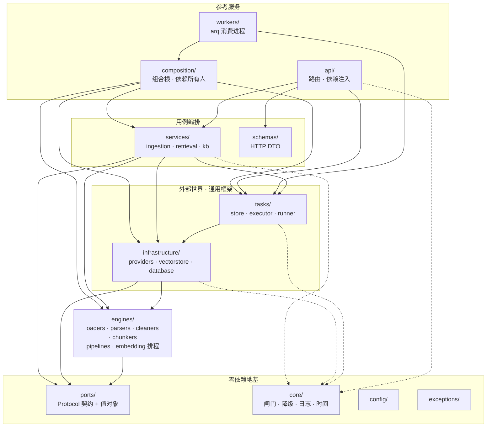
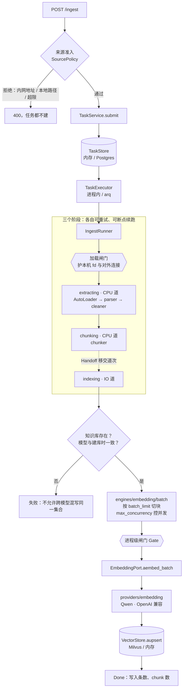
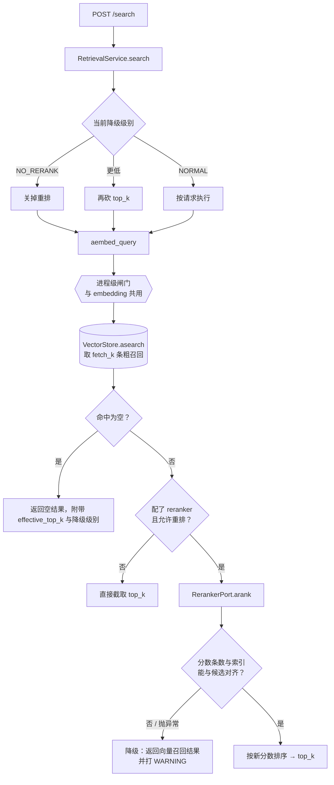

# 目录结构与核心流程

本文回答两个问题：**东西放在哪**，以及**一次请求怎么走完全程**。

图里画的是**实际的依赖边**（用 AST 扫出来的），不是理想中的分层。两者不一致
的地方在文末「已知的接缝」里列出来了 —— 一份画着理想图的架构文档，正是本项目
踩过的那种坑：文档说的规则和守卫执行的规则不是同一条，中间的缝刚好够放一个错误。

## 目录

```text
comet_rag/
├── api/                HTTP 入口（FastAPI）
│   ├── routes/         ingest · search · kb · tasks · admin
│   ├── deps.py         依赖注入：路由只从 Context 取，绝不自己 new
│   └── lifespan.py     启动装配 / 优雅关停
├── workers/            跨进程部署的消费端（arq）
│   ├── embedder.py     IO 道次：调模型服务
│   ├── preprocessor.py CPU 道次：解析、切分
│   └── maintenance.py  租约回收（**单进程模式绝不能加载**）
├── composition/        组合根 —— 依赖所有人，只有进程入口该 import 它
│   ├── bootstrap.py    按配置装配全套资源；模型只在这里被 new
│   └── context.py      长生命周期资源的唯一持有者，逆序关停
├── core/               零依赖内核 —— 被所有人依赖
│   ├── concurrency.py  进程级并发闸门 Gate
│   ├── degradation.py  分级降级控制器
│   ├── logging.py      日志
│   ├── tracing.py      追踪
│   └── time.py         带时区的时间工厂
├── services/           用例编排
│   ├── ingestion.py    IngestRunner：extracting → chunking → indexing
│   ├── retrieval.py    RetrievalService：召回 → 重排
│   ├── knowledge_base.py
│   └── source_policy.py 入库来源准入（SSRF、本地路径、大小上限）
├── schemas/            HTTP 请求/响应 DTO
├── tasks/              通用任务框架（与 RAG 无关，可单独复用）
│   ├── store.py        TaskStore 契约（ABC + 模板方法）
│   ├── store_memory.py / store_postgres.py   两个实现，同跑一套契约测试
│   ├── executor.py / executor_arq.py   执行与重试
│   └── runner.py       StagePipeline：分阶段、可移交道次、可断点续跑
├── infrastructure/     外部世界的适配器
│   ├── providers/      供应商模型服务客户端
│   │   ├── embedding/  OpenAI 兼容 · Qwen3-VL
│   │   ├── reranker/   Qwen3-VL
│   │   └── vision/ llm/ ocr/
│   ├── vectorstore/    Milvus · 内存
│   ├── database/       SQLAlchemy 会话与 ORM 表
│   └── loaders/        S3
├── engines/            纯计算 ← 「库」就是这一层
│   ├── loaders/        本地 · URL · 自动路由
│   ├── parsers/        docx（含 OMML 公式）
│   ├── cleaners/       docx → markdown / blocks
│   ├── chunkers/       文本 · 结构化 · 代码
│   ├── converters/     编码探测 · 压缩包防护
│   ├── pipelines/      Pipeline：串起上面几步，四种运行入口
│   └── embedding/      批量排程（切块 + 限流），不含任何 IO
├── ports/              契约与词汇表 ← 零依赖地基
│   ├── embedding.py    EmbeddingPort · MultimodalEmbeddingPort
│   ├── reranker.py     RerankerPort
│   ├── gate.py         AsyncGate
│   └── content.py      MediaResource · ContentInput · RerankDocument …
├── config/             YAML + 环境变量
└── exceptions/
```

## 模块依赖



**依赖只能向下。** `tests/unit/test_layering.py` 用 AST 强制三条：

| # | 规则 | 破了会怎样 |
|---|------|-----------|
| 1 | `engines/` 不得 import redis / pymilvus / sqlalchemy / arq / fastapi … | 装一个 docx 解析器要拖进一整套中间件，「库」那一半作废 |
| 2 | `engines/` 只能 import `engines` 和 `ports`（**白名单**） | 底层反向依赖上层，`ports/` 存在的意义消失 |
| 3 | `services/` 与 `engines/` 不得 import `infrastructure.providers` | 供应商细节泄漏到用例，换模型要改业务代码 |
| 4 | `core/` 不得 import 本项目任何其他包 | 人人依赖的内核回头依赖上层，立刻出环 |
| 5 | 顶层包之间不得成环 | 环里的包无法被单独理解或单独拿走 |

第 2 条原本是黑名单（禁 api / workers / services）。黑名单只拦得住已经想到的
那几个 —— 后来新增的 `application/` 就从缝里溜了进去。白名单没有这个失效模式：
新包默认被拒。

## 入库流程



窗口（`embed_batch_size`）、每请求条数（`batch_limit`）、并发数
（`max_concurrency`）是**三个不同的旋钮**，见 `docs/model_usage.md`。

## 检索流程



**重排失败一定降级、不失败整个查询** —— 检索是读路径，稍差的结果远好过没有
结果。但降级必须留下日志，否则线上质量下滑无人察觉。

## 改一件事，去哪找

| 想做的事 | 位置 |
|---|---|
| 接一个新的 embedding 服务 | `infrastructure/providers/embedding/`，继承 `BaseEmbeddingModel`，在 `composition/bootstrap.py` 装配 |
| 改「一次请求发几条、几个并发」 | `engines/embedding/batch.py` |
| 改 embedding 契约本身 | `ports/embedding.py`（会波及所有适配器，pyright 会告诉你哪些） |
| 加一种文件格式 | `engines/parsers/` + `engines/pipelines/hooks.py` 注册 |
| 改切分策略 | `engines/chunkers/` |
| 改并发上限 / 背压 | `core/concurrency.py`；数字在 `LimitsConfig`，库兜底在 `engines/defaults.py` |
| 改降级策略 | `core/degradation.py` |
| 加一个 HTTP 端点 | `api/routes/` + `schemas/` |
| 改任务重试 / 断点续跑 | `tasks/runner.py`、`tasks/executor.py` |

## 两条已经修掉的接缝

留在这里，因为它们说明了守卫为什么长成现在这样。

**`core/` 曾经是三样东西**：组合根（顶层，依赖所有人）、策略对象（中层）、
横切设施（底层，人人依赖）。方向相反的东西挤在一个包里，依赖图上 `core`
的箭头就自相矛盾 —— 既指向 `services`，又被 `services` 指向。于是
「`services` 不得依赖 `core`」这条规则**没法一刀切**，也就写不出守卫。

组合根迁到 `composition/` 之后，`core/` 只剩一个含义，第 4 条守卫才成立。

**`infrastructure` 与 `tasks` 曾经互指**，构成包级循环：
`infrastructure/knowledge_base.py` 只为取个当前时间就 import 了
`tasks.models.Time`，而 `tasks/store_postgres.py` 反过来 import
`infrastructure.database`。

环的代价不在于跑不起来（跑得起来），而在于这两个包**再也不能被单独理解或
单独拿走**。`Time` 是个只依赖标准库的时间工具，跟"任务"毫无关系，挪进
`core/time.py` 环就断了。第 5 条守卫盯着它不再回来。

## 仍在的接缝

**`tasks/` 依赖 `infrastructure/database`。** `store_postgres.py` 需要会话与
ORM 表。这是单向的、不成环，但确实让「任务框架可单独复用」打了折 —— 复用时
得连 `infrastructure/database` 一起拿。要收干净得给任务框架定义自己的存储
Port，目前记为已知债务。
